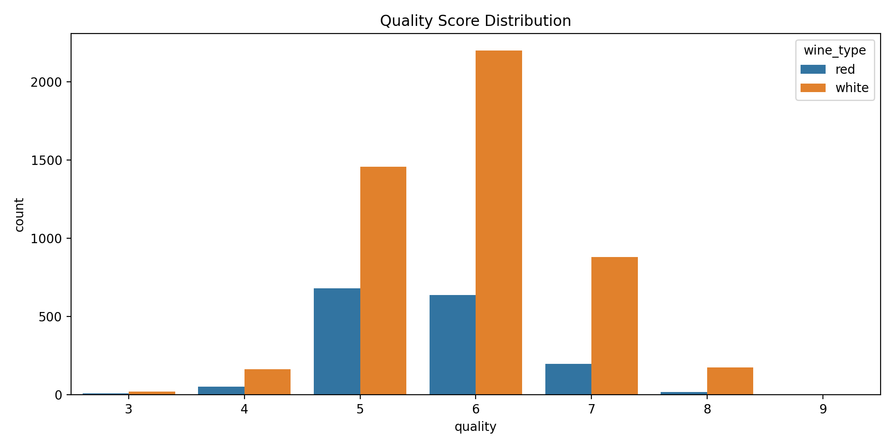
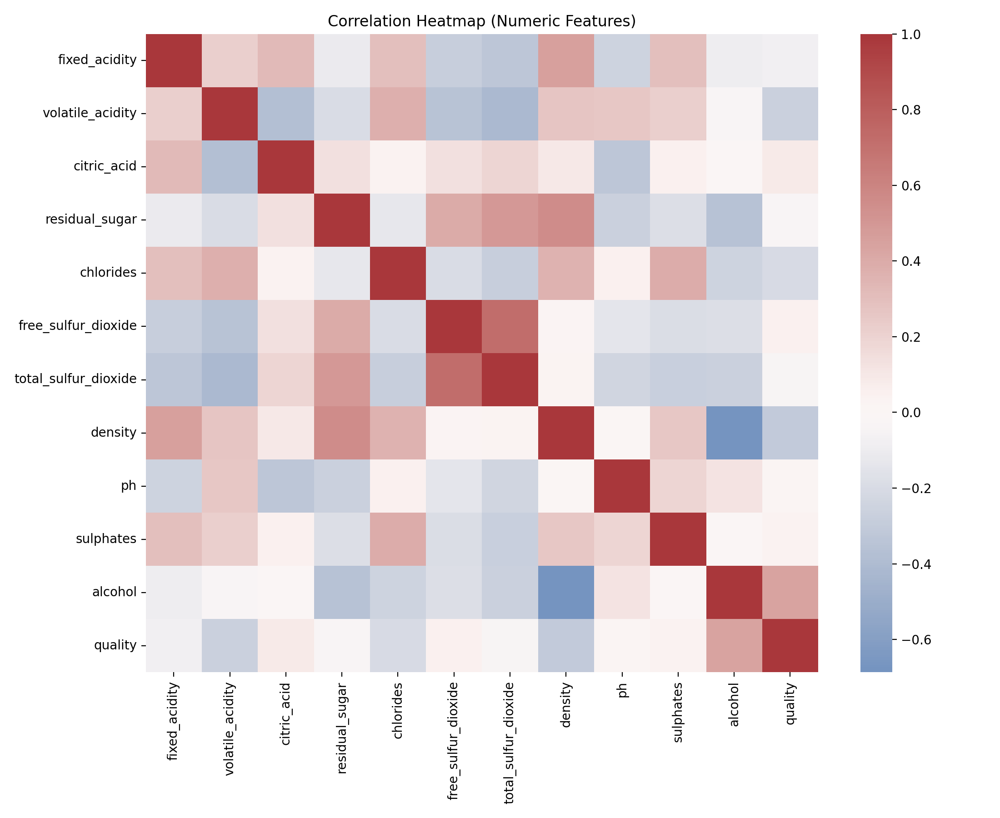
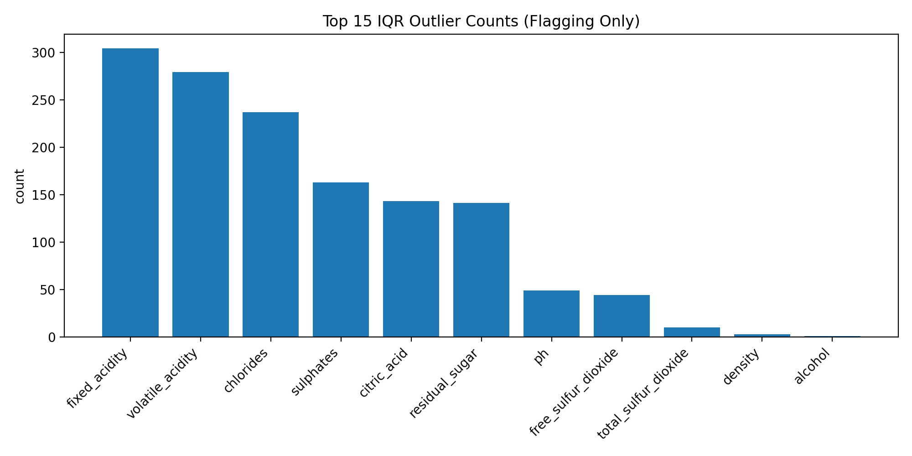
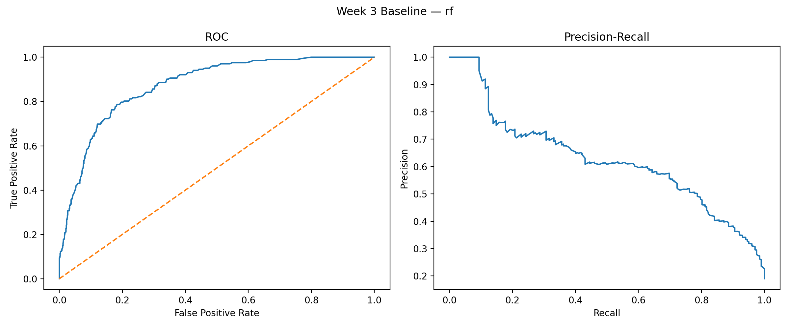
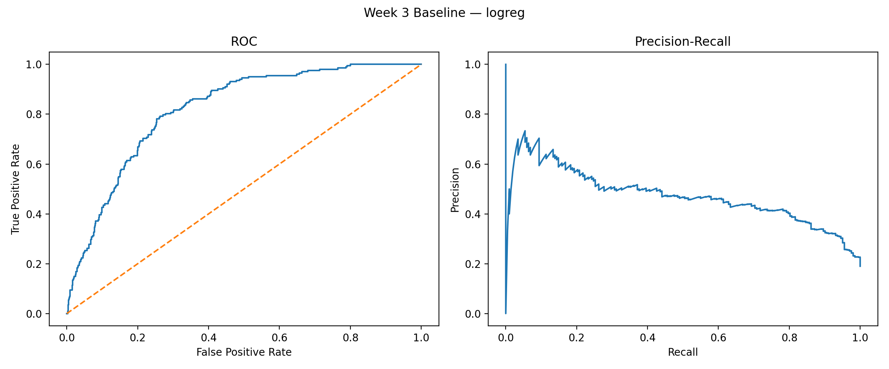
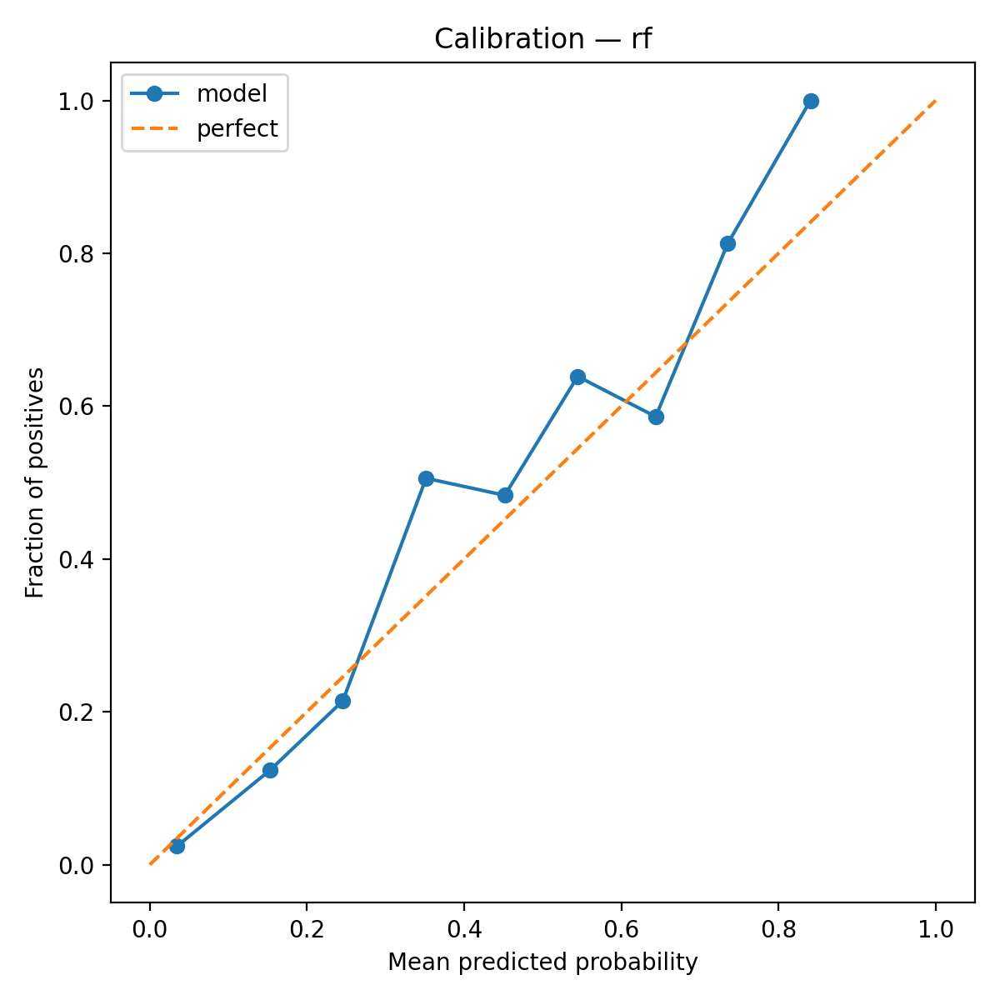
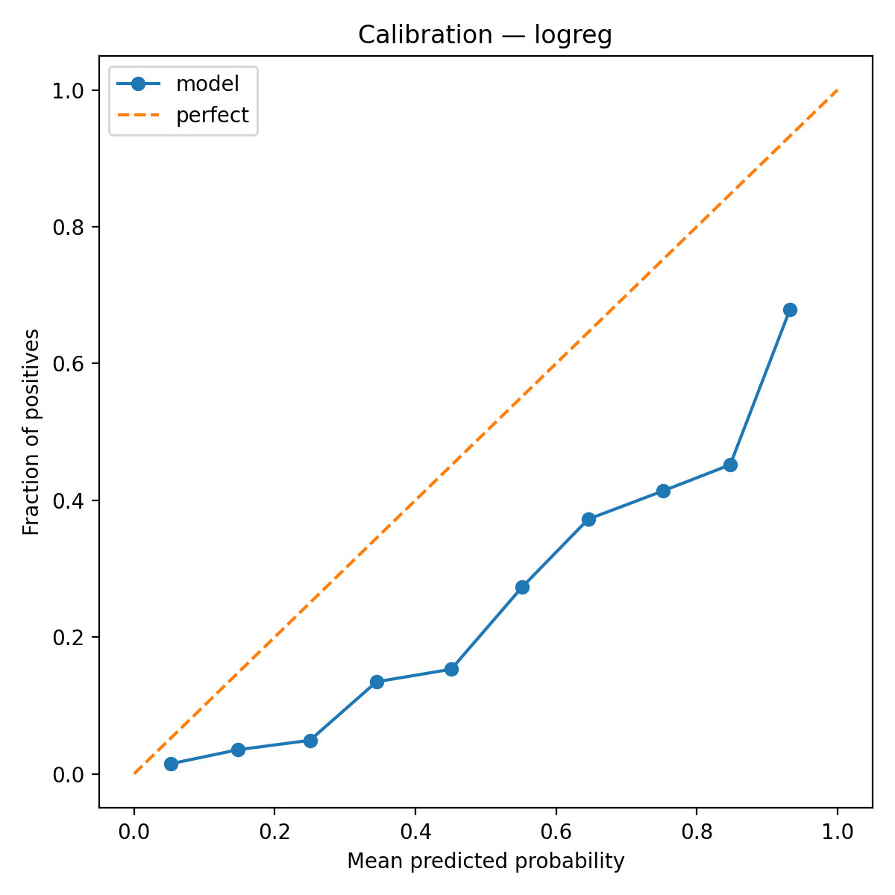

# Food Processing Quality Analytics — 6-Week Internship Project (Real Work + Submission Pack)

This repository contains a complete Week 1 → Week 6 workflow for a food-quality analytics project, implemented as **reproducible code** with **generated evidence** (plots, metrics, CSV/JSON artifacts). Each week is tracked as a publishable folder under `weeks/`.

## Dataset (Public)
Primary dataset used for the executed workflow:
- **UCI Wine Quality (red + white)** — chemical measurements + a quality score.

Source metadata is stored in [data/raw/DATASET_SOURCES.md](data/raw/DATASET_SOURCES.md).

## Results Snapshot (from executed pipeline)
- Raw dataset: **6,497 rows**, **13 columns**, **0 missing values**, **1,177 exact duplicates**
- Cleaned dataset (Week 2): **5,320 rows** after deduplication
- Target (Week 3): **high quality = quality ≥ 7**, positive rate **18.97%**
- Best baseline (Week 5): Random Forest holdout ROC-AUC **0.873**, PR-AUC **0.626**
- Cross-validation (Week 4): Random Forest ROC-AUC **0.857 ± 0.014**, PR-AUC **0.588 ± 0.033**

## Week-by-Week Deliverables (GitHub-friendly)
Each week folder contains:
- `README.md` explaining what was implemented
- `outputs/` with generated artifacts (plots/metrics)
- `submission_description.md` (≥200 words) for the internship portal text box

Week folders:
- [weeks/week-01/](weeks/week-01/) — Data exploration & strategic planning + EDA artifacts
- [weeks/week-02/](weeks/week-02/) — Cleaning pipeline + structured cleaning report
- [weeks/week-03/](weeks/week-03/) — Feature engineering + baseline modeling
- [weeks/week-04/](weeks/week-04/) — Cross-validated model comparison + hypothesis testing
- [weeks/week-05/](weeks/week-05/) — Evaluation, calibration, segment reliability, drift checks
- [weeks/week-06/](weeks/week-06/) — End-to-end documentation + future roadmap

## Figures (embedded)
These figures are generated by the scripts and copied into `figures/` for easy README embedding.

### Week 1 — Quality Distribution

### Week 1 — Correlation Heatmap

### Week 2 — IQR Outlier Counts (flagging only)

### Week 3 — ROC/PR Curves
Random Forest:

Logistic Regression:

### Week 5 — Calibration Curves
Random Forest:

Logistic Regression:

## How to Run (Windows)
1. Activate venv:
   - PowerShell: `.\.venv\Scripts\Activate.ps1`

2. Install dependencies:
   - `pip install -r requirements.txt`

3. Run the workflow in order (downloads data if missing):
   - Download only: `python scripts/01_download_data.py`
   - Week 1: `python scripts/02_week1_eda.py`
   - Week 2: `python scripts/03_week2_clean.py`
   - Week 3: `python scripts/04_week3_features_and_baseline.py`
   - Week 4: `python scripts/05_week4_modeling_and_hypothesis.py`
   - Week 5: `python scripts/06_week5_evaluation_and_risk.py`
   - Week 6: `python scripts/07_week6_docs.py`

## Submission (DOCX)
Generate submission-ready Word documents (one per week + combined):
- `python scripts/08_generate_submission_docx.py`

Outputs are written to [submissions/](submissions/). See [submissions/README.md](submissions/README.md) for what to upload and where to paste the weekly description text.
